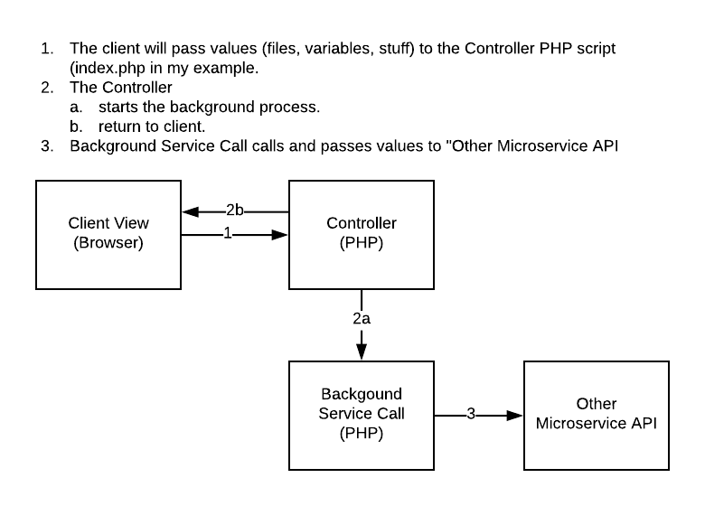

# PHP - Background file upload

## Intro

Let's say we have a form, presented to the user with PHP, and the action of the form is going to upload files to the same PHP server.  Seems normal, but what if we wanted to pass those forms off to another microservice in our system, that would store those files.  If we do this in PHP, not only do we have to wait for the files to first upload to the PHP server, but then we have to wait for the script to upload those files to other server because PHP is synchronous.  We could dive into curl_multiple_*, or even simpler we can shell execute to another PHP script.  I like to think of it as **Poorman's threadin'**.

# Poorman's Threadin' Example

## [The View](index.php)

The view is just a simple form with 2 file inputs, a submit button to upload them, and a results div.

## [The Controller](index.php)

The controller (`index.php`) takes care of the crux of the problem.  If no post values exist it will show the form.  Otherwise it will take the files, and upload them to th "other service" using `exec` to run a PHP script to pass those files on to the "other service."  

## [The Background Call](call_service.php)

The background call is the php script run in the background to call out to the "other service."

## [The "Other Service"](upload.php)

For this example I will use another PHP script for the "other service."  This "other service" will just move the files into the "uploads" directory.  

## Dependencies

This example requires a webservice with PHP module loaded, PHP cli, and the CURL libraries installed for PHP.  Installing and configuring them is outside the scope of this example.

## Caveats

- Make sure that uploads premissions are 777
- You will have to change the path to php to what it is on your server, I use `which php`.
